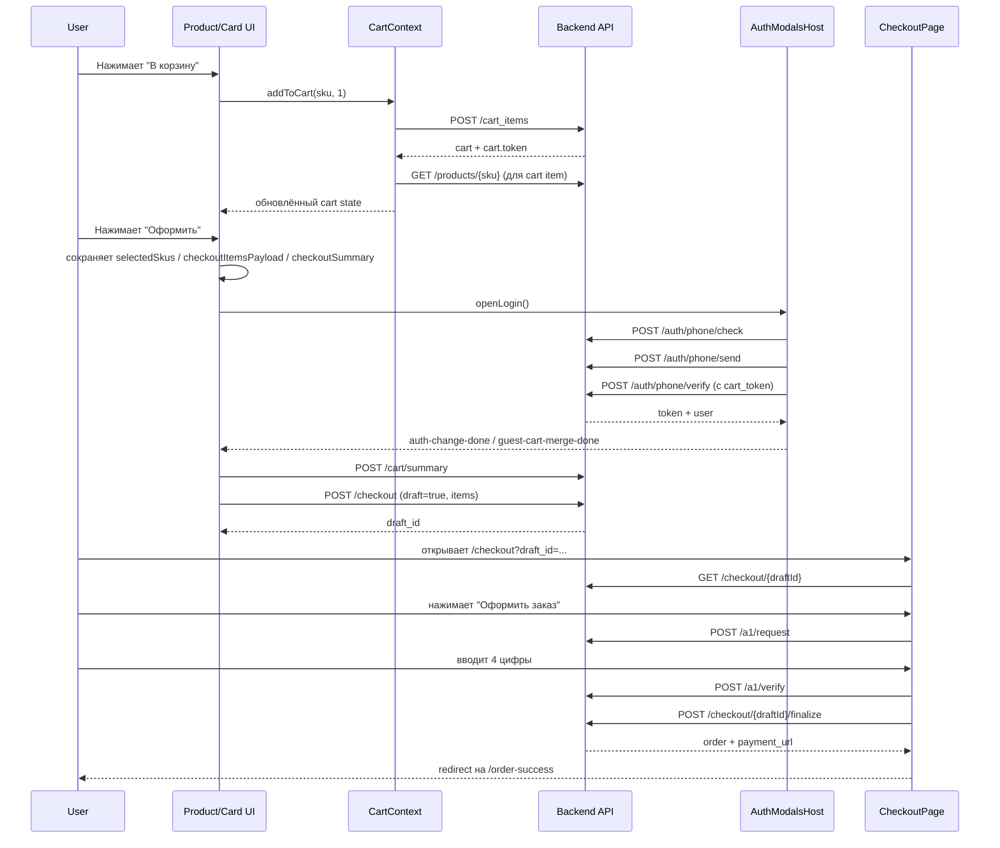
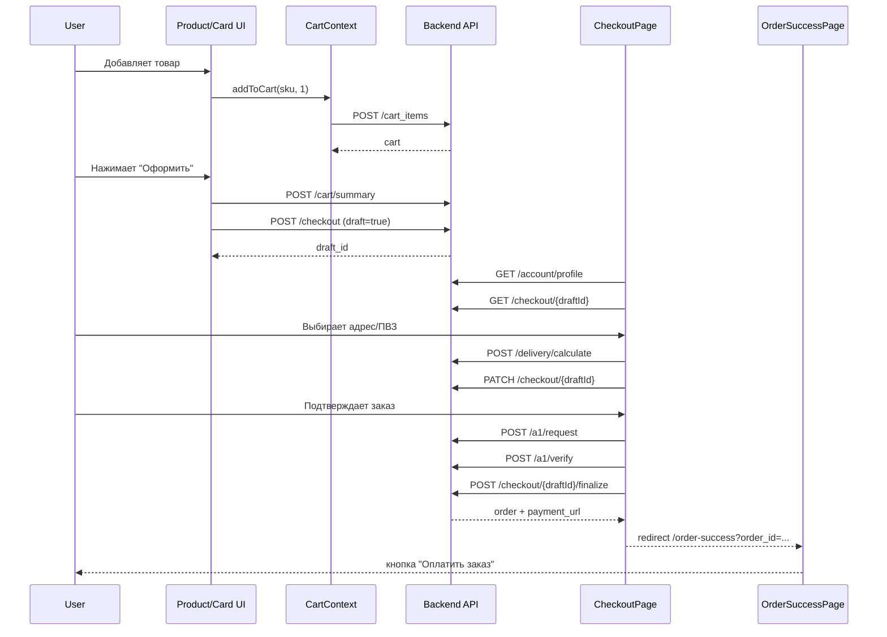
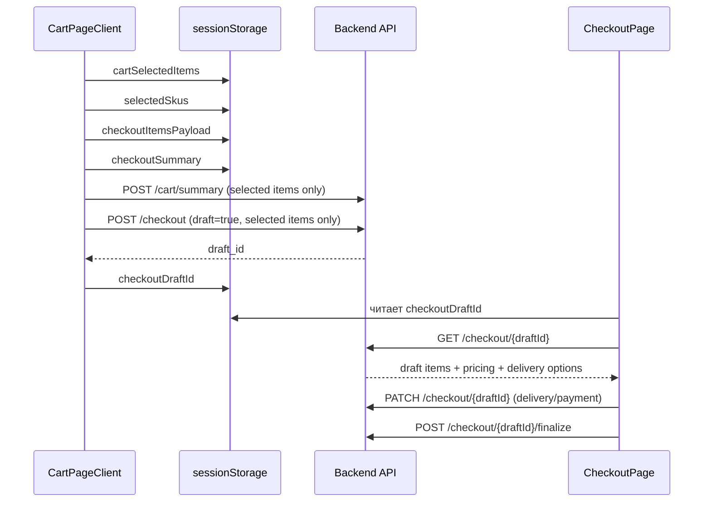

# Cart / Checkout Flow IKEYA

## 1. Область анализа

Документ собран по frontend-коду проекта и описывает активный flow:

- добавление товара в корзину;
- синхронизацию корзины с backend;
- страницу `/cart`;
- переход в `/checkout`;
- guest/auth сценарии;
- выбор доставки и ПВЗ;
- A1-верификацию перед финализацией;
- переход на `order-success`.

Основные активные точки входа:

- `app/layout.js`
- `app/cart/page.js`
- `app/checkout/page.js`
- `app/order-success/page.js`
- `contexts/CartContext.js`
- `contexts/AuthContext.js`
- `components/auth/AuthModalsHost.js`
- `components/cart/CartPageClient.js`
- `components/checkout/CheckoutPage.js`
- `components/delivery/modal/*`
- `components/delivery/map/DeliveryMap.js`

Важно:

- в проекте есть альтернативные/старые реализации, которые **не подключены к активным route-файлам**:
  - `components/cart/CartPage.js`
  - `components/checkout/CheckoutFilledPage.js`
  - `components/checkout/CheckoutErrorPage.js`
  - `components/checkout/CheckoutFilledErrorPage.js`
  - `components/checkout/CheckoutEuropochtaErrorPage.js`
  - `components/auth/AuthModalsProvider.js`
- для активного flow корзины и checkout используется именно `components/auth/AuthModalsHost.js`, потому что он импортируется в `app/layout.js`.

## 2. Общая архитектура корзины

### 2.1 Где хранится состояние

Глобальные provider-ы подключены в `app/layout.js`:

- `AuthProvider` из `contexts/AuthContext.js`
- `CartProvider` из `contexts/CartContext.js`
- `AuthModalsProvider` из `components/auth/AuthModalsHost.js`
- `FavoritesProvider` из `contexts/FavoritesContext.js`

Порядок вложенности:

1. `AuthProvider`
2. `CartProvider`
3. `AuthModalsProvider`
4. `FavoritesProvider`
5. `Header` / страницы / `Footer`

Это значит:

- auth-состояние доступно корзине;
- корзина доступна header/mobile-nav/product-card/product-detail/checkout/profile;
- модалки логина могут инициировать auth-flow прямо из корзины и checkout.

### 2.2 Где хранятся токены

#### Cart token

`lib/api/cart.js`

- key: `cart_token`
- хранится в `localStorage`
- читается через `getCartToken()`
- сохраняется через `setCartToken()`
- удаляется через `removeCartToken()`

Cart token появляется:

- после `POST /api/v1/cart_items`
- после `GET /api/v1/cart`, если backend вернул `response.cart.token`

#### Auth token

`contexts/AuthContext.js` + `lib/api/auth.js`

- key: `auth_token`
- user snapshot: `auth_user`
- activity key: `auth_last_activity`
- auth token хранится в `localStorage`

### 2.3 Как корзина синхронизируется с backend

`contexts/CartContext.js`

`CartProvider` хранит:

- `cart`
- `loading`
- `error`

и публикует:

- `items`
- `itemsCount`
- `totals`
- `delivery`
- `flags`
- `recommendations`
- `availableItems`
- `unavailableItems`
- `refreshCart`
- `addToCart`
- `removeFromCart`
- `removeManyFromCart`
- `updateQuantity`
- `mergeGuestCart`
- `clearCart`
- `applyPromo`
- `removePromo`
- `checkout`

Базовый источник данных корзины:

- `lib/api/cart.js` → `getCart()`

### 2.4 Что происходит при загрузке корзины

`contexts/CartContext.js`

После `isHydrated === true` из `AuthContext` вызывается `fetchCart()`.

`fetchCart()` делает:

1. `cartAPI.getCart()`
2. `getRecommendedProducts({ page: 1, per_page: 10 })`
3. если корзина есть, каждый item дополнительно обогащается через `getProductBySku(item.sku)`

Следствие:

- backend cart сам по себе не считается достаточным для UI;
- frontend для каждого cart item тянет полную карточку товара;
- рекомендации живут внутри состояния корзины как `cart.recommendations`.

### 2.5 Как обновляется count в header

`contexts/CartContext.js`

- `itemsCount = cart?.items_count || 0`

Использование:

- `components/layout/Header/Header.js`
- `components/layout/MobileBottomNav.js`

То есть count в header зависит только от состояния `CartContext`, а не от локального состояния страницы корзины.

## 3. Добавление товара в корзину

## 3.1 Активные точки добавления

Изученные кнопки `В корзину`:

- `components/product/ProductInfo.js`
- `components/product/ProductStickyBar.js`
- `components/catalog/products/ProductCard.js`
- `components/recommendations/ProductCard.js`
- `components/home/PromoBlock.js`
- `components/profile/FavoriteProductCard.js`

Во всех активных местах используется `useCart()` и вызов `addToCart(sku, 1)`.

## 3.2 Общий add-to-cart flow

`contexts/CartContext.js` → `addToCart(sku, quantity)`

Шаги:

1. вызывает `cartAPI.addToCart(sku, quantity)`
2. `lib/api/cart.js` делает `POST /api/v1/cart_items`
3. в body отправляется:
   - `sku`
   - `quantity`
   - `cart_token`, если он уже есть
4. если backend вернул новый `cart.token`, frontend сохраняет его в `localStorage`
5. response cart items проходят через `enrichCartItems(...)`
6. для каждого item вызывается `getProductBySku(item.sku)` для UI-обогащения
7. state `cart` обновляется, рекомендации сохраняются из предыдущего состояния

### 3.3 Как определяется количество в UI

`components/product/ProductInfo.js`
`components/product/ProductStickyBar.js`
`components/catalog/products/ProductCard.js`
`components/recommendations/ProductCard.js`
`components/profile/FavoriteProductCard.js`
`components/cart/CartCounter.js`

Во всех местах текущее количество ищется в `useCart().items` по `sku`.

Если `quantity > 0`:

- вместо кнопки `В корзину` рендерится счетчик

Если `quantity === 0`:

- рендерится кнопка `В корзину`

### 3.4 Что происходит при ошибке

Поведение различается по месту:

- `ProductInfo.js` и `ProductStickyBar.js`: ошибка глушится, UI просто не меняется
- `components/catalog/products/ProductCard.js`: `console.error(...)` + `alert(...)`
- `components/recommendations/ProductCard.js`: `console.error(...)` + `alert(...)`
- `components/home/PromoBlock.js`: `console.error(...)` + `alert(...)`
- `components/profile/FavoriteProductCard.js`: `console.error(...)`

### 3.5 Что происходит, если товар уже есть в корзине

Frontend явно не вызывает отдельный endpoint "increase if exists".

Фактическое поведение:

- повторный `addToCart(sku, 1)` отправляется тем же `POST /api/v1/cart_items`
- итоговое количество определяется backend response

Точное правило backend-merging требует проверки backend/API.

## 4. Изменение quantity и удаление

### 4.1 Из карточек и product detail

`components/cart/CartCounter.js`

- держит `localQuantity`
- синхронизирует его из `serverQuantity`, вычисленного по `useCart().items`
- на `+/-` сразу обновляет локальный state и вызывает `updateQuantity(sku, next)`

### 4.2 Внутри CartContext

`contexts/CartContext.js` → `updateQuantity(sku, newQuantity)`

Поведение:

- если `newQuantity <= 0`, уходит в `removeFromCart(sku)`
- иначе делает optimistic update локального cart state
- затем через debounce `200ms` вызывает `cartAPI.updateCartItemQuantity`
- при ошибке делает `fetchCart()`

Это защищает UI от лишних PATCH на каждый клик, но race condition при очень быстром множественном изменении количества теоретически возможен.

### 4.3 Удаление

Используемые методы:

- `removeFromCart(sku)` → `DELETE /api/v1/cart_items/{sku}`
- `removeManyFromCart({ skus, delete_all })` → `DELETE /api/v1/cart_items`
- `clearCart()` → `DELETE /api/v1/cart`

## 5. Страница `/cart`

### 5.1 Активный route

`app/cart/page.js`

Рендерит:

- `CartPageClient`
- `CartRecommendations`

### 5.2 Что рендерит CartRecommendations

`components/cart/CartRecommendations.js`

- оборачивает `components/recommendations/NotFoundRecommendations.js` в `Suspense`

`NotFoundRecommendations.js` на сервере делает:

- `GET /api/v1/homepage/recommendations?per_page=10`

Это отдельный recommendations-блок страницы корзины, не связанный с `cart.recommendations` из `CartContext`.

### 5.3 Как загружается cart page

`components/cart/CartPageClient.js`

Использует:

- `useCart()`
- `useAuth()`
- `useAuthModals()`

Локальные selection-state:

- `selectedItems`
- `selectedUnavailable`
- `summaryLoading`
- `checkoutLoading`
- `checkoutSummary`

SessionStorage keys:

- `cartSelectedItems`
- `pendingCheckout`
- `selectedSkus`
- `checkoutItemsPayload`
- `checkoutSummary`
- `checkoutDraftId`

### 5.4 Что считается по всей корзине, а что по selected items

#### По всей корзине

Источник:

- `CartContext.cart`
- `CartContext.totals`

Используется для:

- общего `items_count`
- рекомендаций
- promo state
- fallback значений summary

#### По selected items

`CartPageClient.js`

При checkout flow формируется payload:

- массив `{ sku, quantity }` только по выбранным доступным товарам

Для выбранных товаров вызывается:

- `getCartSummary({ items })` → `POST /api/v1/cart/summary`

В sessionStorage пишется normalized summary:

- `subtotal`
- `promoDiscount`
- `itemCount`
- `totalWeight`
- `customsDuty`
- `delivery`
- `logisticsDelivery`
- `finalTotal`
- `europostEligible`
- `availableMethods`

### 5.5 Выбор товаров

`CartPageClient.js`

- при первом появлении available items по умолчанию выбираются все доступные SKU
- если в `sessionStorage.cartSelectedItems` есть сохраненный выбор, он восстанавливается
- unavailable items учитываются отдельно

`components/cart/CartItemsSection.js`

- реализует select all
- indeterminate state
- delete selected

### 5.6 Quantity / delete / bulk delete

`components/cart/CartItem.js`

- `-` при `quantity > 1` уменьшает quantity
- `-` при `quantity === 1` удаляет товар
- отдельная иконка delete тоже удаляет товар

`CartPageClient.js`

- для bulk-delete использует `removeManyFromCart({ skus })`
- для unavailable и available товаров bulk-операции разделены

### 5.7 Промокод

`components/cart/CartSummary.js`

Использует из `useCart()`:

- `applyPromo(code)` → `POST /api/v1/cart/promo/apply`
- `removePromo()` → `DELETE /api/v1/cart/promo/remove`

Активный промокод ищется во frontend так:

- среди `cart.items`
- по `item.pricing.promo_applied`
- и `item.pricing.promo_code`

### 5.8 Totals в UI

`components/cart/CartSummary.js`

Показывает:

- стоимость товаров
- скидку по промокоду
- доставку в Беларусь
- доставку до ПВЗ
- курьерскую доставку
- итог
- количество товаров
- общий вес
- customs duty

### 5.9 Переход к checkout

`CartPageClient.js`

Если пользователь не авторизован:

1. selected payload и summary сохраняются в sessionStorage
2. ставится `pendingCheckout = '1'`
3. открывается `openLogin()`

Если пользователь авторизован:

1. дополнительно запрашивается `getCartSummary({ items })`
2. вызывается `createDraft({ items: checkoutPayload })`
3. сохраняется `checkoutDraftId`
4. переход на `/checkout?draft_id={draftId}`

## 6. Неавторизованный пользователь

### 6.1 Может ли добавлять товары

Да.

Основание:

- `addToCart()` не требует auth token
- используется guest `cart_token`

### 6.2 Может ли открыть корзину

Да.

Основание:

- `/cart` не содержит auth guard
- `getCart()` работает и по `cart_token`

### 6.3 Что происходит при переходе к checkout

`components/cart/CartPageClient.js`

Guest checkout flow:

1. собираются selected items
2. selected summary сохраняется в sessionStorage
3. ставится `pendingCheckout`
4. открывается login/register modal

### 6.4 Как устроен auth-flow

Активная реализация:

- `components/auth/AuthModalsHost.js`

Шаги:

1. `openLogin()` или `openRegister()`
2. ввод телефона
3. `phoneCheck({ phone })`
4. `phoneSend({ phone })`
5. ввод 4 цифр
6. `phoneVerify({ phone, code, cart_token, username?, email? })`
7. `setAuth({ token, user })`
8. `window.dispatchEvent(new Event('auth-change-done'))`
9. через 1 секунду `window.dispatchEvent(new Event('guest-cart-merge-done'))`

Комментарии в коде `AuthModalsHost.js` явно говорят:

- backend должен мержить guest cart по `cart_token` внутри `phoneVerify`

Это frontend-ожидание. Фактическая backend-логика merge требует проверки backend/API.

### 6.5 Где хранится selected context до логина

`sessionStorage`

- `pendingCheckout`
- `selectedSkus`
- `checkoutItemsPayload`
- `checkoutSummary`

### 6.6 Что происходит после успешного логина

`CartPageClient.js` слушает:

- `auth-change-done`
- `guest-cart-merge-done`
- `auth-modal-closed`

После этого страница:

1. восстанавливает pending checkout state
2. при необходимости пытается продолжить `handleCheckoutAuthorized()`
3. повторно создает draft
4. если backend вернул конфликт draft, уходит в существующий `draft_id`

### 6.7 Как frontend восстанавливает cart при проблемах merge

`CartPageClient.js`

Если при `createDraft(...)` возникает guest cart restore error, frontend:

1. достает payload выбранных товаров
2. циклом вызывает `addToCart(sku, quantity)`
3. затем повторяет `createDraft(...)`

Это fallback-механизм на стороне frontend.

## 7. Авторизованный пользователь

### 7.1 Как определяется auth state

`contexts/AuthContext.js`

Признаки:

- `token`
- `user`
- `isAuth`
- `isHydrated`

Session timeout:

- активность хранится в `auth_last_activity`
- TTL = 1 час

### 7.2 Что подтягивается из профиля на checkout

`components/checkout/CheckoutPage.js`

После появления `token` вызывается:

- `getProfile(token)` из `lib/api/cart.js`

Из профиля используются:

- `first_name`
- `last_name`
- `middle_name`
- `phone`
- `email`
- `passport_data.*`
- адрес прописки из `passport_data`

### 7.3 Чем отличается checkout flow

Авторизованный flow:

- не проходит через auth modal
- сразу создает/открывает draft
- может загружать сохраненные адреса доставки
- может загружать сохраненные pickup points

### 7.4 Требуется ли A1 verification

Да, для финального оформления заказа во frontend она обязательна.

`CheckoutPage.js`:

1. при нажатии `Оформить заказ` вызывается `requestA1Verification(profile.phone, 'checkout')`
2. открывается `SmsVerifyModal`
3. после ввода кода вызывается `verifyA1Code(a1VerificationId, code)`
4. только после успешного `verifyA1Code(...)` вызывается `finalizeDraft(...)`

### 7.5 Работа с паспортом

`components/profile/modals/EditPassportModal.js`

Flow редактирования паспорта:

1. заполнение формы
2. `requestA1Verification(phone, 'passport_update')`
3. `verifyA1Code(verificationId, code)`
4. `updateProfile({ passport: ..., verification_id, code })`

## 8. Checkout flow `/checkout`

### 8.1 Активный route

`app/checkout/page.js` → `components/checkout/CheckoutPage.js`

### 8.2 Источники данных при первом рендере

`CheckoutPage.js`

Страница берет контекст из:

- query `draft_id`
- `sessionStorage.checkoutDraftId`
- `sessionStorage.selectedSkus`
- `sessionStorage.checkoutItemsPayload`
- `sessionStorage.checkoutSummary`
- `useCart().items`
- `localStorage.cart_token`

### 8.3 Начальная загрузка checkout

Параллельные источники:

- `getProfile(token)` если есть auth token
- `getDraft(draftId)` если есть draft id
- `getSavedPickupPoints()` если есть token
- `getDeliveryAddresses()` если есть token

Дополнительно восстанавливаются из localStorage:

- `checkout_receive_method`
- `checkout_selected_pvz`
- `checkout_selected_addr`
- `checkout_pvz_calc`
- `checkout_addr_calc`

### 8.4 Как грузится draft

`lib/api/cart.js` → `getDraft(draftId)`

Flow:

1. `GET /api/v1/checkout/{draftId}`
2. если 404/405/422, fallback на `GET /api/v1/checkout/draft?draft_id={draftId}`

`CheckoutPage.js` разбирает:

- `data.attributes`
- `included`
- `relationships.order_items`

и строит:

- `draftItems`
- `checkoutPricing`
- `checkoutDeliveryOptions`

### 8.5 Как передаются selected items

Draft создается на `/cart` через:

- `createDraft({ items: [{ sku, quantity }] })`

На `/checkout` selected items для UI берутся в таком приоритете:

1. `draftItems`, если есть `draftId`
2. `sessionStorage.checkoutItemsPayload`
3. `useCart().items`, отфильтрованные по `sessionStorage.selectedSkus`

### 8.6 Выбор способа доставки

Методы в коде:

- `europost_pickup`
- `courier`
- `ikeya_delivery`

Доступные методы подтягиваются из:

- `checkoutDeliveryOptions?.methods`
- или `checkoutSummary.availableMethods`
- или `cart.delivery.available_methods`

### 8.7 Сохранение доставки в draft

`CheckoutPage.js` → `saveDeliveryToDraft(...)`

Вызывает:

- `updateCheckoutDraft(draftId, payload)` → `PATCH /api/v1/checkout/{draftId}`

Payload может содержать:

- `delivery_type`
- `payment_method`
- `pickup_point_id`
- `delivery_address_id`
- `address`

### 8.8 Самовывоз / ПВЗ

При выборе pickup:

1. `DeliveryModal` открывает `PickupTab`
2. `PickupTab` грузит ПВЗ через `getEuropostOffices({ orderId, cartToken })`
3. после выбора ПВЗ вызывает `calculateDelivery(...)`
4. `CheckoutPage.handleSelectPvz(...)`:
   - сохраняет выбранный ПВЗ
   - пишет его в localStorage
   - делает `saveDeliveryToDraft({ deliveryType: 'europost_pickup', pickupPointId })`
   - для auth user дополнительно сохраняет точку в account через `savePickupPoint(...)`

### 8.9 Адресная доставка

При выборе delivery:

1. `DeliveryModal` открывает `DeliveryTab`
2. пользователь вводит адрес или ставит pin на карте
3. `DeliveryTab` вызывает `calculateDelivery(...)` с `delivery_type: 'courier'`
4. если backend вернул 422 и в available methods есть `ikeya_delivery`, frontend делает fallback-расчет с `delivery_type: 'ikeya_delivery'`
5. `CheckoutPage.handleSelectAddr(...)`:
   - сохраняет адрес и calc result
   - пишет их в localStorage
   - вызывает `saveDeliveryToDraft(...)`
   - для auth user пытается сохранить адрес в account через `createDeliveryAddress(...)`

### 8.10 Финализация заказа

`CheckoutPage.js` → `handleCheckout()` → `handleA1Verify(code)`

Последовательность:

1. frontend валидирует:
   - выбран ли receive method
   - выбран ли pickup point или адрес
   - доступен ли delivery method
2. вызывает `requestA1Verification(profile.phone, 'checkout')`
3. после успешного `verifyA1Code(...)` собирает `finalizePayload`
4. вызывает `finalizeDraft(draftId, finalizePayload)` → `POST /api/v1/checkout/{draftId}/finalize`

`finalizePayload` содержит:

- `full_name`
- `phone`
- `delivery_type`
- `payment_method`
- `a1_verification_id`
- `services`
- `items`
- `pickup_point_id` или `delivery_address_id` или `address`

### 8.11 Payment link / redirect / success

`CheckoutPage.js`

После `finalizeDraft(...)` frontend:

1. достает `payment_url`
2. прогоняет его через `resolvePaymentUrl(...)`
3. сохраняет order snapshot в `sessionStorage.checkoutOrder`
4. сохраняет items в `sessionStorage.checkoutItems`
5. очищает checkout session/local state
6. делает `router.push('/order-success?order_id=...')`

Важно:

- `CheckoutPage.js` **не делает прямой redirect на payment_url**
- payment URL используется уже на `order-success`

`components/order/OrderSuccessPage.js`:

- читает `checkoutOrder`, `checkoutItems`, `selectedPvz`, `selectedDeliveryAddr`, `selectedServices`
- если session данных нет, а есть `order_id` и `token`, делает `GET /api/v1/account/orders/{order_id}`
- показывает кнопку `Оплатить заказ` со ссылкой `paymentUrl`

## 9. Delivery / PVZ / Yandex Maps

### 9.1 Где используется Yandex Maps

Активные компоненты:

- `components/delivery/modal/DeliveryModal.js`
- `components/delivery/PvzPageClient.js`
- `components/delivery/map/DeliveryMap.js`
- `components/delivery/modal/PickupTab.js`
- `components/delivery/modal/DeliveryTab.js`

### 9.2 Когда грузится script

`DeliveryModal.js`

- если `window.ymaps` отсутствует, вставляется:
  - `next/script`
  - `src="https://api-maps.yandex.ru/2.1/?apikey=...&lang=ru_RU"`
  - `strategy="lazyOnload"`

То есть в checkout карта грузится **локально по факту открытия modal**, а не глобально в layout.

### 9.3 Как грузятся pickup points

`PickupTab.js`

- `getEuropostOffices({ orderId, cartToken })`
- backend endpoint: `GET /api/v1/delivery/europost_offices`

Во frontend нормализуются поля:

- `id`
- `provider`
- `name`
- `city`
- `address`
- `phone`
- `working_hours`
- `schedules`
- `break_hours`
- `delivery_date`
- `storage_until`
- `delivery_price_byn`
- `total_delivery_price_byn`
- `available_for_cart`
- `max_weight_kg`
- `lat`
- `lon`

### 9.4 Как выбирается PVZ

`PickupTab.js`

1. пользователь открывает detail карточки
2. выбирает ПВЗ
3. frontend делает `calculateDelivery({ delivery_type: 'europost_pickup', pickup_point_id, items, order_id|cart_token })`
4. `onSelect(point, calcResult)` передается в `CheckoutPage`

### 9.5 Как считается доставка

Используется единый endpoint:

- `POST /api/v1/delivery/calculate`

Контексты:

- `{ order_id, ... }` если draft уже есть
- `{ cart_token, ... }` если draft еще нет

### 9.6 Как хранится выбранный PVZ/адрес

`localStorage`

- `checkout_selected_pvz`
- `checkout_selected_addr`
- `checkout_pvz_calc`
- `checkout_addr_calc`
- `checkout_receive_method`

После финализации во `sessionStorage`:

- `selectedPvz`
- `selectedDeliveryAddr`

## 10. API endpoints

| Endpoint | Method | Frontend файл / функция | Когда вызывается | Payload | Основные поля response | Ошибки / edge cases |
| --- | --- | --- | --- | --- | --- | --- |
| `/api/v1/cart` | GET | `lib/api/cart.js` → `getCart()` | гидрация `CartContext`, refresh cart | `cart_token`, `promo_code` query | `cart`, `cart.token`, `items`, `totals`, `delivery`, `flags` | при 404 cart token удаляется |
| `/api/v1/cart` | DELETE | `lib/api/cart.js` → `clearCart()` | очистка корзины | `cart_token` query | backend ack | после успеха frontend удаляет `cart_token` |
| `/api/v1/cart_items` | POST | `lib/api/cart.js` → `addToCart()` | add to cart из карточек и product page | `sku`, `quantity`, `cart_token?` | `cart`, `cart.token` | merge существующего item требует проверки backend/API |
| `/api/v1/cart_items` | DELETE | `lib/api/cart.js` → `removeManyFromCart()` | bulk delete | `skus`, `delete_all`, `cart_token` | `cart` | зависит от backend валидации списка SKU |
| `/api/v1/cart_items/{sku}` | DELETE | `lib/api/cart.js` → `removeFromCart()` | delete single item | `cart_token` query | `cart` | невалидный SKU / потерянный cart token |
| `/api/v1/cart_items/{sku}` | PATCH | `lib/api/cart.js` → `updateCartItemQuantity()` | quantity update | `quantity`, `cart_token` | `cart` | debounce 200ms, rollback через `fetchCart()` |
| `/api/v1/cart/promo/apply` | POST | `lib/api/cart.js` → `applyPromoCode()` | apply promo | `code`, `cart_token` | `cart`, promo fields | 422 мапится в friendly error |
| `/api/v1/cart/promo/remove` | DELETE | `lib/api/cart.js` → `removePromoCode()` | remove promo | `cart_token` query | `cart` | invalid cart token |
| `/api/v1/cart/summary` | POST | `lib/api/cart.js` → `getCartSummary()` | перед checkout по selected items | `cart_token`, `items[{sku,quantity}]` | summary / delivery / available methods | selected items могут не совпасть с cart state |
| `/api/v1/checkout` | POST | `lib/api/cart.js` → `createDraft()` | создание draft из `/cart` | `items`, `cart_token`, `draft:true` | `draft_id` или эквивалентные поля | conflict draft, item_not_in_cart/item_not_in_draft |
| `/api/v1/checkout` | POST | `lib/api/cart.js` → `checkout()` | общий helper, в активном route напрямую не используется | `orderData` | order/payment data | не используется в активном `/checkout` route |
| `/api/v1/checkout/{id}` | GET | `lib/api/cart.js` → `getDraft()` | загрузка checkout draft | path param | draft attributes, relationships, pricing, delivery options | fallback на `/checkout/draft` |
| `/api/v1/checkout/draft` | GET | `lib/api/cart.js` → `getDraft()` fallback | fallback загрузки draft | `draft_id` query | draft | 404/405/422 на основном endpoint |
| `/api/v1/checkout/{id}` | PATCH | `lib/api/cart.js` → `updateCheckoutDraft()` | сохранение delivery/payment в draft | `delivery_type`, `payment_method`, `pickup_point_id` / `delivery_address_id` / `address` | pricing, delivery options | недоступный delivery method |
| `/api/v1/checkout/{id}/finalize` | POST | `lib/api/cart.js` → `finalizeDraft()` | финализация заказа | `full_name`, `phone`, `delivery_type`, `payment_method`, `a1_verification_id`, `services`, `items`, destination fields | order, `payment_url`, `payment_expires_at` | A1 fail, draft missing, item mismatch |
| `/api/v1/account/profile` | GET | `lib/api/cart.js` → `getProfile(authToken)` | загрузка профиля на checkout | bearer token | profile + passport data | без token не вызывается |
| `/api/v1/account/profile` | PATCH | `lib/api/account.js` → `updateProfile()` | редактирование personal/passport data | profile fields / passport payload | updated profile | field validation errors |
| `/api/v1/auth/phone/check` | POST | `components/auth/AuthModalsHost.js` → `requestCall()` | login/register precheck | `phone` | `exists` | login: not registered, register: already used |
| `/api/v1/auth/phone/send` | POST | `components/auth/AuthModalsHost.js` → `requestCall()` | отправка/звонок кода | `phone` | `message` | send fail |
| `/api/v1/auth/phone/verify` | POST | `components/auth/AuthModalsHost.js` → `submitCode()` | завершение login/register | `phone`, `code`, `cart_token`, `username?`, `email?` | `token`, `user`, `is_new` | 401 invalid code, merge semantics требуют проверки backend/API |
| `/api/v1/a1/request` | POST | `lib/api/account.js` → `requestA1Verification()` | checkout finalization, passport update | `phone`, `context` | `verification_id`, `caller_number_masked` | verify request fail |
| `/api/v1/a1/verify` | POST | `lib/api/account.js` → `verifyA1Code()` | подтверждение A1 | `verification_id`, `last4` | success flag | invalid code |
| `/api/v1/delivery/europost_offices` | GET | `lib/api/delivery.js` → `getEuropostOffices()` | загрузка ПВЗ | `order_id` или `cart_token` | `offices[]` | load fail, no offices |
| `/api/v1/delivery/calculate` | POST | `lib/api/delivery.js` → `calculateDelivery()` | расчет pickup/courier/ikeya delivery | `order_id|cart_token`, `delivery_type`, `pickup_point_id?`, `items`, `address?` | `delivery`, pricing fields, dates | 422 delivery unavailable, fallback courier→ikeya |
| `/api/v1/account/pickup_points` | GET | `lib/api/delivery.js` → `getSavedPickupPoints()` | загрузка сохраненных ПВЗ auth user | bearer token | `data[]` | auth required |
| `/api/v1/account/pickup_points` | POST | `lib/api/delivery.js` → `savePickupPoint()` | сохранение выбранного ПВЗ | provider/external fields, coords | saved point | duplicate semantics описаны в комментарии |
| `/api/v1/account/pickup_points/{id}` | DELETE | `lib/api/delivery.js` → `deleteSavedPickupPoint()` | удаление saved PVZ | path param | ack | invalid id |
| `/api/v1/account/delivery_addresses` | GET | `lib/api/delivery.js` → `getDeliveryAddresses()` | загрузка saved addresses | bearer token | `data[]` | auth required |
| `/api/v1/account/delivery_addresses` | POST | `lib/api/delivery.js` → `createDeliveryAddress()` | сохранение адреса доставки | address fields, coords | saved address | field_errors / errors |
| `/api/v1/account/delivery_addresses/{id}` | DELETE | `lib/api/delivery.js` → `deleteDeliveryAddress()` | удаление saved address | path param | ack | invalid id |
| `/api/v1/products/{sku}` | GET | `contexts/CartContext.js` → `enrichCartItems()` через `getProductBySku()` | обогащение cart items | path param | product data | если товар не найден, UI зависит от fallback item data |
| `/api/v1/homepage/recommendations` | GET | `contexts/CartContext.js`, `components/recommendations/NotFoundRecommendations.js` | cart recommendations и блок под корзиной | `page`, `per_page` | `data[]` | может грузиться в двух независимых местах |

## 11. Edge cases и риски

### 11.1 Уже обработанные во frontend

- `item_not_in_cart` / `item_not_in_draft` при создании draft: есть restore fallback в `CartPageClient.js`
- conflict draft / `checkout_draft_exists`: frontend пытается открыть существующий draft
- courier недоступен, но доступен `ikeya_delivery`: есть fallback-расчет
- потерянный cart token: `getCart()` удаляет token при 404
- quantity update error: `CartContext.updateQuantity()` откатывается через `fetchCart()`
- promo invalid/expired: ошибка показывается через toast
- отсутствует адрес/ПВЗ: checkout блокируется frontend-валидацией
- payment_url с localhost: есть `resolvePaymentUrl(...)`

### 11.2 Риски, остающиеся в текущем flow

- `CartContext.fetchCart()` обогащает каждый item через `/products/{sku}`; при большом cart это дополнительная сеть
- `CartRecommendations` грузит отдельные recommendations независимо от `cart.recommendations`
- backend merge guest cart через `phoneVerify` не подтвержден frontend-кодом как факт, только ожидается комментариями
- прямой redirect на payment не выполняется в `CheckoutPage.js`; пользователь попадает сначала на `order-success`
- selected items и фактический draft могут разойтись между `/cart` и `/checkout`
- price/availability могут измениться после выбора товаров и до finalize
- если `profile.phone` отсутствует, checkout не сможет стартовать A1 flow
- race condition при быстром изменении количества теоретически возможен из-за optimistic update + debounce

### 11.3 Что не найдено в frontend-коде

- явный frontend-flow для `item_not_in_draft` после уже загруженного `/checkout` не найден, кроме общих ошибок draft/finalize
- отдельная success/failure страница именно оплаты не найдена в анализируемом cart/checkout наборе
- точное backend-правило истечения payment link и автоотмены заказа требует проверки backend/API

## 12. Sequence diagrams

### 12.1 Guest: add to cart → login → checkout → A1 → finalize

### 12.2 Auth user: add to cart → checkout → delivery → payment

### 12.3 Selected items / draft flow

## 13. Итоговая карта файлов

| Файл | Роль в flow | Ключевые функции / состояния |
| --- | --- | --- |
| `app/layout.js` | подключение глобальных provider-ов | `AuthProvider`, `CartProvider`, `AuthModalsProvider` |
| `contexts/AuthContext.js` | auth session и hydration | `setAuth`, `logout`, `isHydrated` |
| `contexts/CartContext.js` | глобальное cart state | `fetchCart`, `addToCart`, `updateQuantity`, `applyPromo`, `refreshCart` |
| `lib/api/cart.js` | cart/checkout API-слой | `getCart`, `addToCart`, `createDraft`, `finalizeDraft`, `getDraft`, `updateCheckoutDraft` |
| `lib/api/auth.js` | phone auth API | `phoneCheck`, `phoneSend`, `phoneVerify` |
| `lib/api/account.js` | profile/A1/account API | `getProfile`, `updateProfile`, `requestA1Verification`, `verifyA1Code`, `reorder` |
| `lib/api/delivery.js` | delivery/PVZ/account delivery API | `getEuropostOffices`, `calculateDelivery`, `getSavedPickupPoints`, `createDeliveryAddress` |
| `app/cart/page.js` | route `/cart` | `CartPageClient`, `CartRecommendations` |
| `components/cart/CartPageClient.js` | активная cart page логика | selected items, summary, draft creation, guest checkout continuation |
| `components/cart/CartSummary.js` | totals + promo UI | `applyPromo`, `removePromo`, totals render |
| `components/cart/CartItemsSection.js` | selection UI | select all, bulk delete |
| `components/cart/CartItem.js` | item row | quantity, delete, favorites, unavailable state |
| `components/cart/CartCounter.js` | quantity control вне cart page | `localQuantity`, `updateQuantity` |
| `components/auth/AuthModalsHost.js` | активный login/register flow | `openLogin`, `requestCall`, `submitCode` |
| `components/product/ProductInfo.js` | add to cart с product detail | `handleAddToCart`, `handlePlus`, `handleMinus` |
| `components/product/ProductStickyBar.js` | sticky add-to-cart | `handleAddToCart`, qty sync |
| `components/catalog/products/ProductCard.js` | add to cart из каталога | `handleAddToCart`, `CartCounter` |
| `components/recommendations/ProductCard.js` | add to cart из recommendations | `handleAddToCart`, `CartCounter` |
| `components/home/PromoBlock.js` | add to cart из home promo slider | `handleAddToCart` |
| `components/profile/FavoriteProductCard.js` | add to cart из favorites | `handleAddToCart` |
| `app/checkout/page.js` | route `/checkout` | `CheckoutPage` |
| `components/checkout/CheckoutPage.js` | активный checkout flow | `getDraft`, `handleSelectPvz`, `handleSelectAddr`, `handleCheckout`, `handleA1Verify` |
| `components/delivery/modal/DeliveryModal.js` | modal выбора доставки | local Yandex Maps script, tab switch |
| `components/delivery/modal/PickupTab.js` | выбор ПВЗ | `getEuropostOffices`, `calculateDelivery` |
| `components/delivery/modal/DeliveryTab.js` | выбор адресной доставки | geocode, map pin, `calculateDelivery` |
| `components/delivery/map/DeliveryMap.js` | карта Yandex | `window.ymaps`, placemarks, delivery pin |
| `components/delivery/modal/SavedAddressesModal.js` | saved PVZ / saved addresses | select/save/delete UI |
| `components/profile/modals/EditPersonalDataModal.js` | редактирование personal data | `updateProfile` |
| `components/profile/modals/EditPassportModal.js` | паспорт + A1 при обновлении | `requestA1Verification`, `verifyA1Code`, `updateProfile` |
| `components/profile/modals/SmsVerifyModal.js` | универсальная A1 code modal | `onVerify`, `onResend` |
| `components/order/OrderSuccessPage.js` | post-finalize экран | чтение sessionStorage, fallback `GET /account/orders/{id}`, кнопка оплаты |

## 14. Короткие выводы

- Активный cart/checkout flow построен вокруг `CartContext` + `AuthModalsHost` + draft checkout через `/api/v1/checkout`.
- Guest пользователь может полностью собрать корзину и только перед draft creation проходит auth.
- Финальный checkout всегда требует A1 verification во frontend.
- После `finalizeDraft` frontend не отправляет пользователя сразу на payment gateway, а сначала ведет на `/order-success`, где уже используется `payment_url`.
- В проекте есть несколько legacy/mock реализаций cart/checkout/auth, но активные route-файлы используют другие компоненты; это важно учитывать при дальнейших изменениях.
